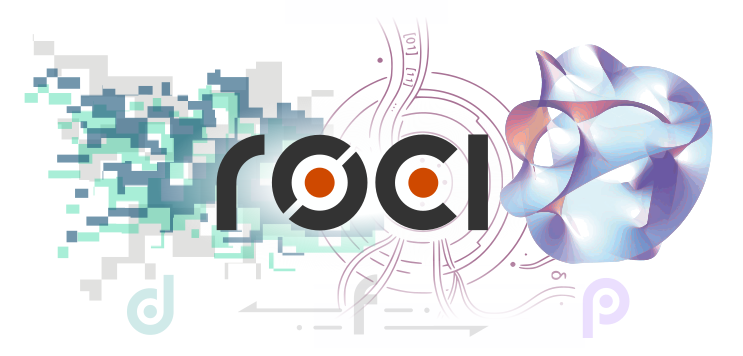

# Repository of Computational Imaging

<p align="center">
  
</p>

[](https://doi.org/10.5281/zenodo.18778617)

ROCI is a collection of minimalistic, high-quality, and self-contained PyTorch (re-)implementations of algorithms used in computational imaging. In terms of applications, it currently focuses on forward and inverse problems appearing in computational MRI (reconstruction, quantification, synthesis, physics simulation). In terms of techniques, ROCI includes classical signal processing algorithms as well as state-of-the-art representation learning and generative modeling methods. 

Each algorithm, including the classical signal processing methods, are written in PyTorch. This means autograd compatibility and GPU-accelerated compute. 

ROCI is a collection of self-contained and documented algorithms, not a coherent Python library (yet). This code is meant for educational and research purposes only.


<!-- ## Why ROCI

Original software implmentations offered by paper authors vary largely in quality and style and may be incomplete, outdated, or implemented in a less familiar language or library. This introduces a barrier for other applied reseachers benchmarking their work, engineers building prototype systems on these techniques, and students learning the practical programming conventions and tricks. ROCI bridges this gap by offering software re-implementations that are concise, self-contained, standardized in style, and well-documented. 

These implementations are tested for correctness, are based primarily on PyTorch, and follow the PEP8 style guide. This means a wide range of readily accessible and usable computational imaging algorithms, all in one place. -->


## Code Organization

All algorithms are stored in the [`algorithms`](algorithms) directory. The directory structure is simple: `algorithm = python_file + demo_notebook + readme`.
```
algorithms
    |
    |- algo_1
    |   |- algo_1.py
    |   |- Demo.ipynb
    |   |- README.md
    |
    |- algo_2
    |   |- algo_2.py
    |   |- Demo.ipynb
    |   |- README.md
    ...
```

ROCI also provides tiny versions of some algorithms applied on miniature toy problems, e.g. generative modeling of toy distributions in 2D space. These can be found in the [`tiny`](tiny) directory.


## Available Algorithms

MRI reconstruction:
- [SENSE parallel-imaging reconstruction](algorithms/sense/)
- [CG-SENSE parallel-imaging reconstruction](algorithms/cg_sense/)
- [Compressed sensing reconstruction](algorithms/cs/)
- [MoDL unrolled network](algorithms/modl/)
- [Implicit neural representations for differentiable uncalibrated imaging](algorithms/diff_uncalib_img/)
- [Deep image prior](algorithms/dip/)

MRI forward physics simulation:
- [Bloch signal simulation](algorithms/bloch/)
- [Extended phase graphs (EPG) method](algorithms/epg/)

MRI quantification:
- [Physics-informed MLP for MRF parameter mapping](algorithms/mrf_pm_mlp/)


## Coming Soon

Inversion:
- [Equivariant imaging](https://arxiv.org/abs/2103.14756)
- [Equivariant splitting](https://arxiv.org/abs/2510.00929)
- [Double blind imaging with generative modeling](https://arxiv.org/abs/2503.21501)
- [Compressed-sensing with generative modeling (CSGM)](https://arxiv.org/abs/1703.03208)
- [Plug-and-play reconstruction based on content/style modeling](https://arxiv.org/abs/2409.13477)
- Plug-and-play inversion based on diffusion modeling and flow matching
- [noise2noise denoising](https://arxiv.org/abs/1803.04189)
- BM3D denoising
- [GRAPPA parallel-imaging reconstruction](https://pubmed.ncbi.nlm.nih.gov/12111967/)
- [ESPIRiT parallel-imaging](https://pmc.ncbi.nlm.nih.gov/articles/PMC4142121/)
- [Motion-corrected MRI with DISORDER](https://pubmed.ncbi.nlm.nih.gov/31898832/)
- [Magnetic resonance spin tomography in time-domain (MR-STAT)](https://doi.org/10.1016/j.mri.2017.10.015)
- [Data-driven discovery of mechanical models directly from MRI spectral data](https://arxiv.org/abs/2411.06958)
- [Neural Inverse Rendering from Propagating Light](https://arxiv.org/abs/2506.05347)

Representations:
- Gaussian representations
- [Structured representations using flow-based models](https://link.springer.com/book/10.1007/978-3-031-88111-4)
- [Non-linear ICA for Principled Disentanglement in Unsupervised Deep Learning](https://arxiv.org/abs/2303.16535)
- [From Pixels to Components: Eigenvector Masking for Visual Representation Learning](https://arxiv.org/abs/2502.06314)
- [Tensorial radiance fields](https://arxiv.org/abs/2203.09517)

Forward physics modeling:
- [Unified Bloch and EPG method](https://www.nature.com/articles/s41598-021-00233-6)
- [Phase distribution graphs (PDG) method for MR signal simulation](https://pubmed.ncbi.nlm.nih.gov/38576164/)
- [Quantum mechanical MRI simulations](https://pmc.ncbi.nlm.nih.gov/articles/PMC6641938/)
- [UltimateSynth: MRI Physics for Pan-Contrast AI](https://pubmed.ncbi.nlm.nih.gov/39713417/)
- [Neural surrogates based on PINNs](https://www.sciencedirect.com/science/article/pii/S0021999118307125)
- [Neural surrogates based on Fourier neural operators](https://arxiv.org/abs/2010.08895)


## Citation

If you use any code from this repository, please cite it as:
```
@software{Rao_Repository_of_Computational_2026,
author = {Rao, Chinmay},
month = feb,
title = {{Repository of Computational Imaging (ROCI)}},
version = {0.1.1},
year = {2026}
}
```